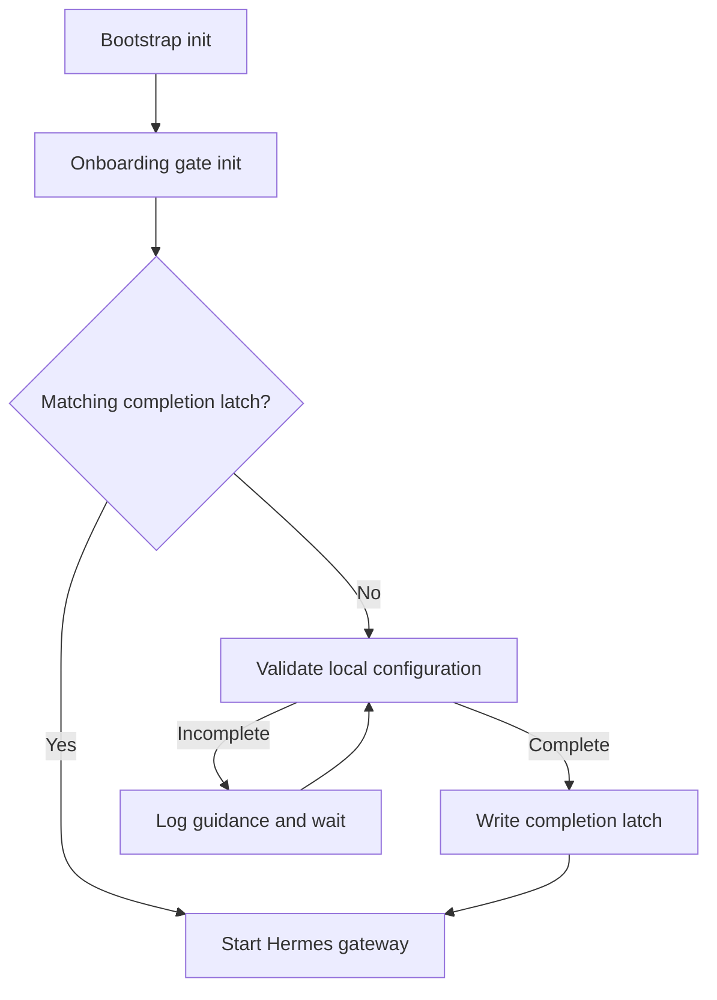

# Hermes Agent Helm Chart: Onboarding Gate Design

**Status:** Proposed  
**Audience:** Chart maintainers and implementation agents (Codex/Claude)  
**Scope:** Add an optional, configurable onboarding gate to the existing Hermes Agent Helm chart without building a derivative Hermes image.

## Context

The chart currently starts the Hermes gateway immediately after its bootstrap init container finishes. That works for an already-configured instance, but a new instance may still need an LLM provider and one or more messaging platforms configured interactively. If the gateway starts before that work is complete, it can appear deployed while still being unusable.

The initial use case is a second Hermes instance for Des:

- Photon/iMessage is the primary user interface.
- Telegram, the Hermes CLI, and a Cloudflare Access-protected dashboard are operator/support paths.
- Des is non-technical, so Mike must be able to complete or repair onboarding through `kubectl exec`.
- The chart must also support other combinations, such as Photon only, Telegram only, Discord only, or any supported combination.

Hermes currently has no trustworthy, machine-readable `is onboarded` command. In particular, existing human-oriented status/doctor commands have inconsistent exit-code behavior. The chart therefore needs a small validator that uses the same configuration and provider/platform logic as Hermes itself.

## Goals

1. Hold the main gateway container until the configured onboarding requirements have been satisfied once.
2. Let an operator enter the waiting init container and run normal interactive Hermes setup commands.
3. Support a chart-defined required provider and selectable required platforms.
4. Allow an existing, already-configured deployment to adopt the feature without forcing setup to be repeated.
5. Avoid blocking every future restart because an external provider or messaging service is temporarily unavailable.
6. Preserve the chart's current use of the official `nousresearch/hermes-agent` image.
7. Produce clear, actionable, secret-safe diagnostics while the pod is waiting.

## Non-goals

- A browser-based onboarding wizard.
- Live runtime health checking or continuous platform monitoring.
- Performing an inference request during pod startup.
- Proving that an external API is currently reachable.
- Managing Cloudflare Tunnel or Access in this change.
- Replacing Hermes' own interactive setup commands.
- Introducing a second, chart-specific configuration system for Hermes platforms.

## Decision summary

Add a first-class optional `onboarding-gate` init container. It will run after the existing bootstrap init container and before the main Hermes gateway container.

The validator and wait wrapper will be regular files in the Helm chart, rendered into a ConfigMap and mounted read-only into the init container. The init container will reuse the same official Hermes image, persistent home volume, configuration, and secret-backed environment as the gateway.

**Do not add or update a Dockerfile for this feature.** A derivative image would add image builds, vulnerability ownership, architecture publishing, upstream-version skew, and a second release lifecycle to a chart that intentionally deploys the official image. Reusing the application image also ensures that the validator imports the Hermes code corresponding to the installed version.

The gate records a small completion latch on the persistent volume. On ordinary restarts, a matching latch allows startup immediately. The latch represents “these requirements were successfully configured,” not “all external services are healthy right now.”

## Lifecycle



While the gate is waiting, an operator can use `kubectl exec -it ... -c onboarding-gate -- sh` and run the usual Hermes setup commands. The polling process notices the completed configuration, writes the latch, exits successfully, and permits Kubernetes to start the main container.

## Proposed values API

Add this block to `values.yaml`:

```yaml
onboarding:
  # Disabled by default for backward compatibility.
  enabled: false

  requirements:
    # Require a usable local LLM provider configuration.
    provider: true

    # Platforms that must be locally configured before first startup.
    # Initial supported values: photon, telegram, discord.
    platforms: []

  # Maximum time allowed for one validation attempt. This bounds internal
  # provider resolution if an upstream implementation attempts a refresh.
  validationTimeoutSeconds: 15

  # Delay between unsuccessful validation attempts.
  pollIntervalSeconds: 10

  # Optional init-container resources.
  resources: {}

# When non-null, render spec.progressDeadlineSeconds on the Deployment.
# Interactive onboarding commonly warrants an override such as 3600.
progressDeadlineSeconds: null
```

Example for Des:

```yaml
onboarding:
  enabled: true
  requirements:
    provider: true
    platforms:
      - photon
      - telegram
  validationTimeoutSeconds: 15
  pollIntervalSeconds: 10

progressDeadlineSeconds: 3600
```

Example for Photon only:

```yaml
onboarding:
  enabled: true
  requirements:
    provider: true
    platforms:
      - photon
```

The requirement list is deliberately separate from platform configuration. It tells the gate which Hermes configurations must exist; it does not configure or enable those platforms. Actual configuration remains in Hermes configuration, environment variables/secrets, or interactive Hermes setup. This avoids two competing sources of truth.

Update `values.schema.json` to enforce:

- `onboarding.enabled` is boolean.
- `requirements.provider` is boolean.
- `requirements.platforms` is an array with unique values.
- Initially accepted platform names are `photon`, `telegram`, and `discord`.
- timeout and interval values are positive integers with reasonable minimums.
- `progressDeadlineSeconds` is null or a positive integer.
- If supported by the schema tooling, onboarding requires persistence to be enabled. Otherwise enforce this with a Helm template failure and document it.

Onboarding should fail chart rendering when `onboarding.enabled=true` and persistence is disabled. Interactive setup and the completion latch must survive pod replacement; allowing an ephemeral onboarding configuration would create a misleading deployment.

## Chart file changes

Expected implementation changes:

| File | Change |
|---|---|
| `values.yaml` | Add onboarding and progress-deadline values with documentation. |
| `values.schema.json` | Validate the new values and supported platforms. |
| `templates/onboarding-configmap.yaml` | Render the validator, wait wrapper, and normalized requirements. Only render when enabled. |
| `files/onboarding/check.py` | Implement one non-interactive validation attempt and latch handling. |
| `files/onboarding/wait.sh` | Run the validator with a timeout, log diagnostics, sleep, and retry. |
| `templates/deployment.yaml` | Add the ordered init container, volumes, mounts, checksum annotation, and optional progress deadline. |
| `templates/_helpers.tpl` | Add small helpers for normalized requirements/checksums if useful. |
| `README.md` | Document values, lifecycle, operator commands, timeouts, and recovery. |
| `tests/*_test.yaml` | Add Helm rendering and ordering tests. |

Store the scripts under `files/onboarding/` and include them with `.Files.Get` rather than embedding long programs directly in a template. Render them into a chart-managed ConfigMap with keys such as:

- `check.py`
- `wait.sh`
- `requirements.json`

Mount the ConfigMap read-only at `/opt/hermes-chart/onboarding`. Invoke the wrapper explicitly with `/bin/sh`; do not depend on the executable bit or on Bash being present.

Add a pod-template checksum annotation covering the onboarding ConfigMap content so script or requirements changes trigger a rollout.

## Init-container specification

The `onboarding-gate` init container must:

- Appear after the existing bootstrap init container. Kubernetes runs init containers in list order.
- Reuse the main Hermes image repository, tag, pull policy, and pull secrets.
- Receive the same `HERMES_HOME`, configuration environment, secret environment, and relevant `envFrom` sources as the gateway.
- Mount the same persistent Hermes home at the same path.
- Mount any writable temporary volumes needed by the official image and interactive Hermes commands.
- Mount the onboarding ConfigMap read-only.
- Run with the chart's compatible container security context and the same effective user that owns `HERMES_HOME`.
- Not run s6 or the gateway process.
- Remain suitable for `kubectl exec -it` while it waits.
- Avoid setting a non-interactive environment variable that would prevent the operator from using Hermes menus in a second exec session.
- Use `onboarding.resources` if set.

Refactor common environment and volume-mount template fragments into helpers if necessary. Duplicating secret/env construction between the gateway and gate is likely to drift and can make the validator report a false missing credential.

Do not set a pod `activeDeadlineSeconds`; onboarding is intentionally allowed to wait for a human. `progressDeadlineSeconds` only changes how the Deployment reports stalled progress. Argo CD may show the Deployment as progressing or degraded after that deadline even though the init container remains available for onboarding. The README should explain this distinction.

## Validator contract

`check.py` performs exactly one bounded, non-interactive check. It should support at least these modes:

```text
check.py --requirements /opt/hermes-chart/onboarding/requirements.json
check.py --requirements ... --force
```

Normal behavior:

1. Load and validate the normalized requirements document.
2. Compute or accept a deterministic requirements hash containing:
   - latch schema version;
   - provider requirement;
   - sorted required platform names;
   - validator compatibility version.
3. If a valid completion latch has the same hash, exit successfully without resolving providers or contacting external services.
4. Otherwise load the local Hermes configuration using Hermes' own configuration loader.
5. Validate the required provider and each required platform.
6. If all checks pass, atomically write the latch and exit successfully.
7. If any check fails, print a concise list of missing or incompatible items and exit with a distinct incomplete status.

Suggested exit codes:

| Code | Meaning | Wait-wrapper action |
|---:|---|---|
| 0 | Complete, or matching latch exists | Exit init container successfully. |
| 10 | Configuration incomplete | Log guidance, sleep, retry. |
| 20 | Validator/configuration error | Log prominently, sleep, retry so operator can inspect. |
| 124 | Attempt timed out | Log timeout, sleep, retry. |

The exact numeric codes may change, but incomplete configuration must be distinguishable from a broken validator. The init container may continue waiting in either case, but diagnostics must clearly tell the operator which condition exists.

The wrapper should print a short status heartbeat rather than a full traceback every ten seconds. Deduplicate unchanged diagnostics or print the full missing-item report at a slower interval to keep logs usable.

### Provider validation

Use the same runtime provider resolution path used by the Hermes gateway and CLI, currently centered on `hermes_cli.runtime_provider.resolve_runtime_provider()`, or the upstream equivalent for the chart's pinned application version.

The check must establish that local credentials/configuration select a usable provider. It must not send a model prompt. Because an internal resolver may refresh OAuth or otherwise touch the network, every attempt must be externally bounded by `validationTimeoutSeconds`. Prefer a local-only upstream API when available.

Do not parse display text from `hermes status`, `hermes doctor`, or similar human-facing commands, and do not trust their current exit codes as the onboarding signal.

### Platform validation

Implement a small validator registry keyed by platform name. Each validator should use Hermes' own config/credential loaders where possible and return structured missing-item diagnostics. Do not log credential values.

Minimum checks for the initial platforms:

| Platform | Minimum local completion checks |
|---|---|
| Photon | Platform enabled; Photon project credentials resolve; registered user/phone and assigned line state exist; required sidecar dependencies are installed. Accept a valid pairing-mode configuration where Hermes supports it rather than requiring a static allowlist globally. |
| Telegram | Platform enabled; bot token resolves; Hermes' configured authorization/pairing mode is internally valid. Do not require live Bot API access. |
| Discord | Platform enabled; required bot/application credentials resolve; authorization/pairing configuration is internally valid. Do not require a live Discord connection. |

Home-channel or cron-delivery settings are useful operational configuration but are not prerequisites for a runnable platform and should not block onboarding unless a future explicit requirement is added.

Keep all imports behind narrow adapter functions. These are upstream internal APIs and may move between Hermes versions. When an import or expected interface is incompatible, emit a message that names the validator and Hermes version, for example: `Photon validator is incompatible with Hermes vX; update the chart validator`. Do not collapse this into “Photon is not configured.”

## Completion latch

Use a chart-owned file under `HERMES_HOME`, for example:

```text
${HERMES_HOME}/.helm-onboarding-complete.json
```

Example contents:

```json
{
  "schemaVersion": 1,
  "requirementsHash": "sha256:...",
  "completedAt": "2026-08-21T00:00:00Z",
  "hermesVersion": "...",
  "requirements": {
    "provider": true,
    "platforms": ["photon", "telegram"]
  }
}
```

Requirements:

- Write atomically by creating a temporary file in `HERMES_HOME`, flushing it, and using `os.replace`.
- Store no tokens, secrets, phone numbers, user IDs, or provider account details.
- Treat malformed JSON, a schema mismatch, or a requirements-hash mismatch as no valid latch.
- A matching latch bypasses provider/platform validation on restart.
- A requirements change causes validation to run again. Adding Telegram to the required list therefore intentionally blocks the next rollout until Telegram is configured.
- A Hermes image-version change alone should not invalidate the latch. Validator compatibility with the new image is covered by CI; forcing live revalidation on every image upgrade would make transient external/provider behavior a deployment risk.

`--force` ignores the latch for diagnosis but should not delete it merely because a transient check fails.

## Existing-install migration

The feature defaults to disabled, so current releases render exactly as before.

When onboarding is enabled on an existing instance such as `hermes-mike`:

1. No latch exists.
2. The gate checks the existing persistent Hermes configuration.
3. If it already meets the declared requirements, the gate writes the latch and exits automatically.
4. The main gateway starts without requiring setup to be repeated.

Disabling onboarding later removes the gate and ConfigMap but may leave the harmless latch file on the PVC. The chart should not delete user or state files automatically.

## Failure and timeout behavior

- Kubernetes init containers have no inherent short timeout. The gate can wait indefinitely for an operator.
- Each individual validation attempt is bounded by `validationTimeoutSeconds`.
- A timeout is not success and must not write the latch.
- Temporary provider or platform outages after successful onboarding do not prevent restarts because the matching latch short-circuits validation.
- A broken validator does prevent first gated startup and must be reported distinctly from missing configuration.
- The dashboard in the main container will not become available until onboarding completes. That is expected; operator access during onboarding is through Kubernetes exec and logs.

## Operator runbook

Find the pending pod and inspect the gate:

```sh
kubectl -n hermes-des get pods
kubectl -n hermes-des logs <pod-name> -c onboarding-gate -f
```

Enter the waiting init container:

```sh
kubectl -n hermes-des exec -it <pod-name> -c onboarding-gate -- sh
```

Run the normal setup commands required by the gate, for example:

```sh
hermes model
hermes photon setup
# Run the appropriate Hermes Telegram or Discord setup command if required.
```

Exit the shell. The wait loop should detect the updated state within `pollIntervalSeconds`, write the latch, and allow the gateway to start.

For diagnosis after onboarding, run the validator with `--force` from either a deliberately waiting gate or the main container if the script mount is present there. The initial implementation does not need to mount the script into the main container; the README may instead document temporarily removing/renaming the latch from an exec session and restarting the pod. Any such recovery procedure must warn that changing the PVC is an operator action and must never be performed automatically by Helm.

## Security requirements

- The ConfigMap contains code and requirement names only, never secrets.
- Credentials stay in the existing Secret/ExternalSecret and environment mechanisms.
- The gate receives only the same credentials needed by the eventual gateway.
- Never print secret values or serialize them into the latch.
- Redact exception messages if an upstream client may include a token or URL credential.
- Disable service-account token mounting when the chart already supports doing so; the validator does not need Kubernetes API access.
- Keep the script mount read-only and the writable scope limited to the existing Hermes home and required temporary volumes.
- Do not add a Service, Ingress, or externally reachable setup endpoint for onboarding.

## Testing plan

### Helm unit tests

Add tests that verify:

1. Onboarding disabled renders no onboarding ConfigMap, init container, volume, or checksum annotation.
2. Onboarding enabled renders the ConfigMap and gate.
3. Bootstrap remains the first init container and onboarding is the next one.
4. The gate reuses the main image and mounts the same Hermes home.
5. Secret-backed environment and `envFrom` configuration reach the gate.
6. Photon-only, Telegram-only, Discord-only, and multi-platform requirements render correctly.
7. Duplicate or unsupported platforms fail schema validation.
8. Enabled onboarding with persistence disabled fails with an actionable message.
9. `progressDeadlineSeconds` is omitted when null and rendered when set.
10. A script or requirement change changes the pod-template checksum.

Run at minimum:

```sh
helm lint ./charts/hermes-agent
helm unittest ./charts/hermes-agent
helm template test ./charts/hermes-agent -f tests/fixtures/onboarding-values.yaml
```

Adjust paths to the repository's actual chart layout.

### Validator tests

Test `check.py` with a temporary `HERMES_HOME` and mocked/narrow adapter functions:

- No provider configured.
- Each supported platform incomplete and complete.
- Multiple missing requirements reported together.
- Successful atomic latch creation.
- Matching latch short-circuits all adapters.
- Malformed and stale latch behavior.
- No secret values appear in stdout/stderr or the latch.
- Internal import/API incompatibility is classified as a validator error.
- External timeout produces no latch.

### Image compatibility smoke test

CI should run the validator against the exact official Hermes image tag selected by the chart `appVersion` or default image tag. This catches moved internal modules before a chart release without building a derivative image. At minimum, verify that the script imports its adapters and can inspect an empty temporary `HERMES_HOME` with the expected incomplete exit status.

## Acceptance criteria

- With onboarding disabled, the rendered workload remains backward compatible.
- With onboarding enabled and no configuration, the pod remains in init state and logs actionable missing requirements.
- An operator can exec into the init container and run interactive Hermes commands.
- After satisfying the configured provider/platform requirements, the gate exits and the gateway starts without a manual pod restart.
- An already-configured instance creates its first latch and starts automatically.
- A matching latch lets the workload restart during a simulated provider/platform outage.
- Changing the required platform set invalidates the old latch and re-runs validation.
- Photon, Telegram, and Discord can each be required independently or together.
- No Dockerfile or custom Hermes image is introduced.
- Helm lint, schema validation, Helm unit tests, validator tests, and official-image compatibility smoke tests pass.

## Implementation guidance for Codex/Claude

Before editing, inspect the actual repository and preserve its helper patterns, labels, security contexts, bootstrap semantics, and test conventions. Do not assume the filenames above are exact if the current chart layout differs.

Implement this as a focused chart feature. Avoid unrelated refactors. If the pinned Hermes version's internal APIs differ from the names in this document, trace the actual gateway/CLI code paths and build narrow adapters around those current APIs. Record any divergence in code comments and tests. Do not fall back to scraping human-readable CLI output unless no programmatic interface exists, and if that compromise is necessary, stop and surface it for review before completing the implementation.
